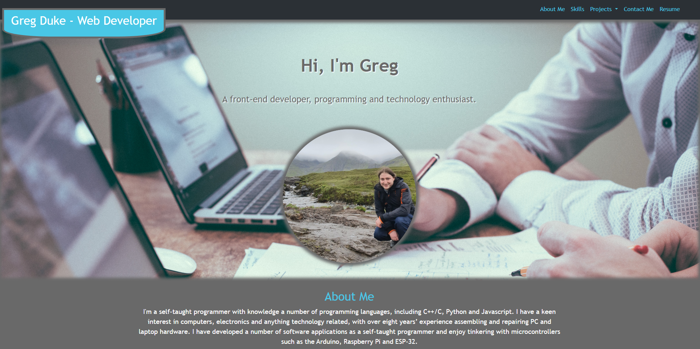
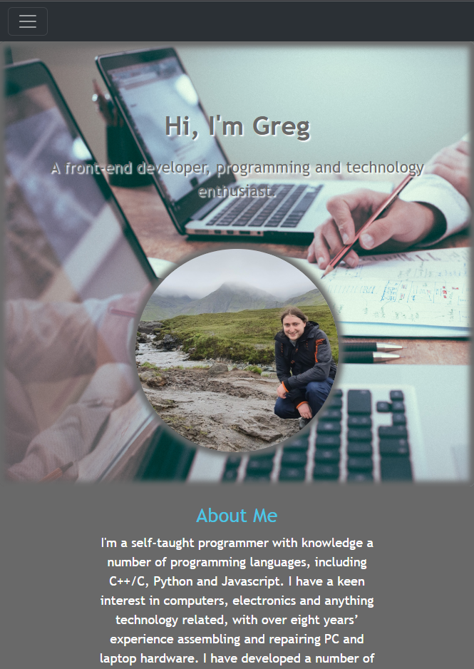
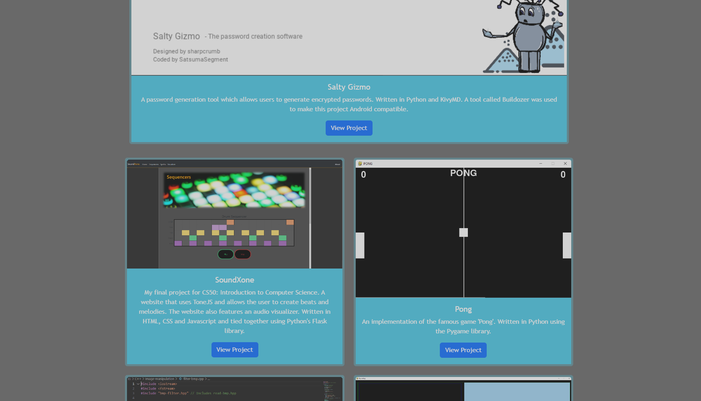
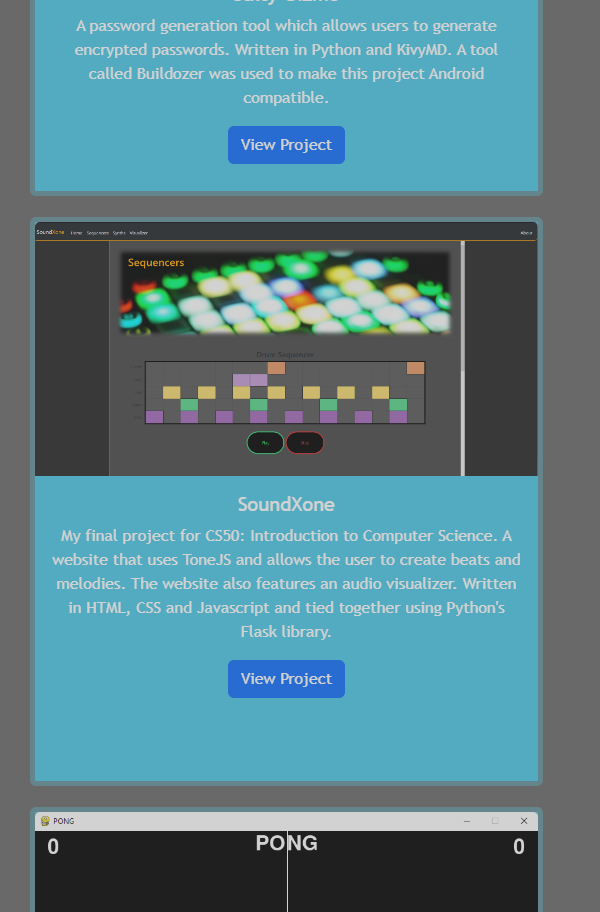

# Bootstrap-Portfolio

## Description

This is the third challenge assignment for the Front-end Bootcamp Course. In this challenge, I have recreated my personal portfolio website using Bootstrap components.

Using Bootstrap allows for a more responsive website with less need for media queries.

I used Bootstrap for the navbar at the top of the page and customized it to fit my website's theme. The navbar features a dropdown list which contains links to different projects; when clicked, the user will be taken to that specific project in the "Projects" section of the website. The navbar will automatically switch to a "hamburger menu" when the display size is around 900 pixels, allowing for a more user friendly experience on devices with a smaller screen. 

For the projects section I used Bootstrap cards and laid them out using a `grid` layout. The Bootstrap cards are a parctical way to store information and work perfectly for this section in a `gird` layout. The cards feature a picture of the project, a breif description and a button which will take you to the project's GitHub repository. When the screen size is around 850 pixels, the cards will be displayed as one-per-row, perfect for people using mobile devices with a smaller display size.

Below are some images which show the responsiveness of the website:

## Installation

N/A

## Usage

The website can be accessed via this link: https://satsumasegment.github.io/Bootstrap-Portfolio/

## License

N/A

